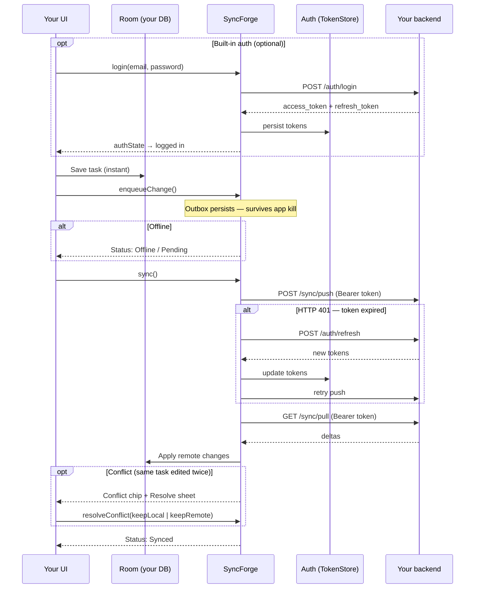

# SyncForge documentation

**Version:** `2.0.0` · **Maven Central:** `2.0.0` pending publish (latest live: `1.1.0` — [upgrade guide](docs/UPGRADE_1_1_TO_2_0.md))

SyncForge is an offline-first sync library for Android with Kotlin Multiplatform targets for
iOS, JVM desktop, and native macOS. Your app entities live in Room (Android) or your own
store; SyncForge owns a separate SQLDelight outbox and conflict database. Mutations go through
an outbox; push/pull talk to your backend over a pluggable transport.

> Kotlin **package names** stay `dev.syncforge.*`; Maven **groupId** and Gradle **plugin id** use
> `studio.syncforge`. See [docs/MAVEN_PUBLISH.md](docs/MAVEN_PUBLISH.md).

---

## Start here

| I want to…                                     | Read this                                                                                      |
|------------------------------------------------|------------------------------------------------------------------------------------------------|
| **Get a working app in ~10 minutes**           | [Getting Started](docs/GETTING_STARTED.md)                                                     |
| **Copy-paste solutions for common tasks**      | [Recipes](docs/RECIPES.md)                                                                     |
| **Understand and configure conflict handling** | [Conflict Resolution](docs/CONFLICT_RESOLUTION.md)                                             |
| **Design entities and choose strategies**      | [Best Practices](docs/BEST_PRACTICES.md)                                                       |
| **Set up SyncForge on Android**                | [Android Setup](docs/ANDROID_SETUP.md)                                                         |
| **Set up SyncForge on iOS**                    | [iOS Setup](docs/IOS_SETUP.md)                                                                 |
| **Set up SyncForge on desktop (JVM)**          | [Desktop Setup](docs/DESKTOP_SETUP.md)                                                         |
| **Understand the KMP migration plan**          | [KMP Migration](docs/KMP_MIGRATION.md)                                                         |
| **Look up every public type**                  | [Module Reference](docs/MODULES.md)                                                            |
| **Implement the backend HTTP contract**        | [REST API](docs/REST_API.md)                                                                   |
| **Custom backend / BaaS transport**            | [Custom transport](docs/CUSTOM_TRANSPORT.md)                                                   |
| **Production tracing (OpenTelemetry)**         | [Tracing](docs/TRACING.md)                                                                     |
| **Parent/child entities & orphan FKs**         | [Hierarchical sync](docs/HIERARCHICAL_SYNC.md)                                                 |
| **Add login/register (built-in auth)**         | [Auth API](docs/AUTH_API.md)                                                                   |
| **See what's planned next**                    | [Roadmap](docs/ROADMAP.md)                                                                     |
| **Plan releases 1.0 → 2.0**                    | [Roadmap 1.0–2.0](docs/ROADMAP_1_0_TO_2_0.md)                                                  |
| **Track 1.0 release blockers (P0)**            | [Roadmap 1.0–2.0 § 1.0.0](docs/ROADMAP_1_0_TO_2_0.md#100-sign-off-checklist)                   |
| **Swift / SKIE interop (iOS)**                 | [Swift interop](docs/SWIFT_INTEROP.md)                                                       |
| **Compose conflict UI (CMP)**                  | [Compose UI](docs/COMPOSE_UI.md)                                                             |
| **Cut a release (manual)**                     | [Release process](docs/RELEASE.md)                                                           |
| **Maven Central publish (2.0+)**               | [Maven Publish](docs/MAVEN_PUBLISH.md)                                                         |
| **Record README demo GIF**                     | [docs/images/README.md](docs/images/README.md)                                                 |
| **Track release changes**                      | [Changelog](CHANGELOG.md)                                                                      |

---

## See it in action

<p align="center">
  
</p>

<p align="center">
  <sub>Add task → sync → <strong>conflict</strong> → clear local DB → pull from server · <a href="docs/images/README.md">re-record</a></sub>
</p>

```bash
./gradlew :mock-server:run          # Terminal 1
./gradlew :sample:installDebug      # Terminal 2 (emulator → http://10.0.2.2:8080)
```



### What the demo shows

| Scenario               | What to do                                                        | What you see                                                               |
|------------------------|-------------------------------------------------------------------|----------------------------------------------------------------------------|
| **1. Offline-first**   | Add a task with airplane mode on                                  | Task appears in Room immediately; status shows pending / offline           |
| **2. Sync**            | Turn network on → tap **Sync**                                    | Push + pull run; row shows **Synced**; outbox drains                       |
| **3. Empty local DB**  | Tap **Clear local DB** in the demo panel → **Sync**               | Room wiped; tasks disappear; pull restores data from mock-server           |
| **4. Edit conflict**   | Sync a task → tap **Server edit** → edit locally → **Sync** again | **Conflict** chip appears; tap **Resolve** to pick local or server version |
| **5. Delete conflict** | Sync a task → edit locally → tap **Server delete** → **Sync**     | Conflict: keep local row vs accept server tombstone                        |
| **6. Multi-entity**    | Open **Notes** / **Tags** tabs                                    | Three entity types, per-type conflict strategies (`deferToUser` vs LWW)    |
| **7. Relationships**   | Add a tag → create a note with that tag                           | Notes reference tags by ID (app-level FK; sync is per entity)              |

**Debug console (debug builds):** tap the **SF** overlay to inspect the outbox, sync health, events, and open conflicts.

---

## Feature catalog (2.0.0)

Every major capability with a minimal copy-paste sample. Deep dives: [Recipes](docs/RECIPES.md) · [Module reference](docs/MODULES.md).

| Area | What you get | Sample module / doc |
|------|----------------|---------------------|
| **Core sync** | Outbox, push/pull, optimistic writes | `:sample` · [REST API](docs/REST_API.md) |
| **Android DSL** | SQLDelight outbox, WorkManager, Compose UI | `:sample` · [Android setup](docs/ANDROID_SETUP.md) |
| **iOS / desktop / macOS** | Stable KMP DSLs, BGTaskScheduler, JVM desktop | `:sample-ios-shared`, `:sample-desktop` · [iOS](docs/IOS_SETUP.md) · [Desktop](docs/DESKTOP_SETUP.md) |
| **Web (experimental)** | `SyncForge.web { }`, Ktor JS transport | `:sample-web` · [Web setup](docs/WEB_SETUP.md) |
| **Conflict strategies** | LWW, defer, merge, `gitLike`, `crdt`, runtime policy | `:sample` · [Conflict resolution](docs/CONFLICT_RESOLUTION.md) |
| **Entity store** | Room DAO, `@SyncForgeStore`, in-memory tests | [Recipes → BYO store](docs/RECIPES.md#byo-entity-store-syncforgestore) |
| **Auth** | Built-in register/login/refresh, bearer tokens | [Auth API](docs/AUTH_API.md) |
| **DI** | Koin + Hilt helpers | [Recipes → DI](docs/RECIPES.md#dependency-injection-koin--hilt) |
| **Transports** | REST (default), GraphQL, Supabase, Firebase, custom | `:mock-server`, `:backend-starter-*` · [Custom transport](docs/CUSTOM_TRANSPORT.md) |
| **Observability** | Debug console, SyncHealth, OpenTelemetry | [Tracing](docs/TRACING.md) · [Recipes → debug](docs/RECIPES.md#use-the-in-app-debug-console) |
| **Hierarchical data** | Parent/child FK recipes | [Hierarchical sync](docs/HIERARCHICAL_SYNC.md) |
| **Backend** | Ktor, Spring Boot, GraphQL reference servers | `:mock-server`, `:backend-starter-spring` |

### Core sync loop

Your UI writes to **your** database; SyncForge owns a separate outbox. Mutations enqueue; sync drains the outbox and applies remote deltas.

```kotlin
// Repository — instant local write + background sync
taskDao.insert(task.copy(syncState = SyncState.PENDING))
syncManager.enqueueChange(Change.create(TaskEntity.ENTITY_TYPE, task))
syncManager.sync()  // or push() / pull() separately
```

Runnable backend locally: `./gradlew :mock-server:run` then point `baseUrl` at `http://10.0.2.2:8080` (emulator).

### Platform entry points

**Android** — [`SampleApplication.kt`](sample/src/main/kotlin/dev/syncforge/sample/SampleApplication.kt):

```kotlin
syncManager = SyncForge.android(this) {
    baseUrl(BuildConfig.SYNC_BASE_URL)
    registry(SyncForgeHandlers.registry(noteDao, tagDao, taskDao))
    conflicts { sampleEntityConflicts() }
    schedulePeriodicSyncOnStart()
}
```

**iOS** — [`IosSampleController.kt`](sample-ios-shared/src/iosMain/kotlin/dev/syncforge/sample/ios/IosSampleController.kt):

```kotlin
SyncForge.ios {
    baseUrl(baseUrl)
    registry(handlers)
    backgroundSyncTaskIdentifier("com.myapp.sync.refresh")
    schedulePeriodicSyncOnStart()
}
```

**JVM desktop** — [`DesktopSampleController.kt`](sample-desktop/src/main/kotlin/dev/syncforge/sample/desktop/DesktopSampleController.kt):

```kotlin
SyncForge.desktop {
    baseUrl(baseUrl)
    registry(EntityRegistry.of(taskHandler, noteHandler, tagHandler))
    databaseName("my-app-sync.db")
    schedulePeriodicSyncOnStart()
}
```

**Browser (experimental, monorepo-only)** — [`WebSampleController.kt`](sample-web/src/jsMain/kotlin/dev/syncforge/sample/web/WebSampleController.kt):

```kotlin
SyncForge.web {
    baseUrl(baseUrl)
    registry(handlers)
    syncOnTabVisible()  // optional pull when tab gains focus
}
```

### Entities & KSP codegen

Annotate entities and DAOs; build once — KSP generates handlers and `SyncForgeHandlers.registry(...)`.

```kotlin
@SyncForgeEntity(entityType = "tasks")
@Entity(tableName = "tasks")
@Serializable
data class TaskEntity(/* id, fields, localVersion, updatedAtMillis, syncState */) : SyncedEntity

@SyncForgeDao(entityClass = "com.example.tasks.TaskEntity")
@Dao
interface TaskDao { /* findById, insert, update, deleteById, observeAll */ }
```

**BYO store** (Realm, SQLDelight, in-memory) — `@SyncForgeStore` + optional `syncforge-store-room` / `syncforge-store-inmemory`:

```kotlin
@SyncForgeStore(entityClass = "com.example.tasks.TaskEntity")
class TaskEntityStore(dao: TaskDao, db: AppDatabase) : RoomEntityStore<TaskEntity>(dao, db)

registry(SyncForgeHandlers.registry(taskEntityStore))
```

### Conflict resolution

Per-entity policies in `conflicts { }`. Reference matrix from [`SampleConflictPolicies.kt`](sample/src/main/kotlin/dev/syncforge/sample/conflicts/SampleConflictPolicies.kt):

| Strategy | Sample use | Snippet |
|----------|------------|---------|
| `lastWriteWins()` | Simple rows (tags) | `entity("tags") { lastWriteWins() }` |
| `alwaysRemote()` | Server-owned content (notes) | `entity("notes") { alwaysRemote() }` |
| `deferToUser()` | User picks winner in UI | `entity("tasks") { deferToUser() }` |
| `merge { }` | Field-level auto-merge | See [Recipes → merge](docs/RECIPES.md#custom-merge-with-merge--) |
| `gitLike { }` | Independent field merges + defer on clash | See below |
| `crdt { }` | CRDT field merge (counters, sets) | [Conflict resolution](docs/CONFLICT_RESOLUTION.md) |

**`gitLike` three-way merge** (tasks in `:sample`):

```kotlin
entity("tasks") {
    gitLike<TaskEntity> {
        threeWayMerge { base, local, remote ->
            // Non-overlapping title vs completed edits → Merged(...)
            // Same field edited on both sides → Unmergeable
        }
        onUnmergeable { deferToUser() }
        onRemoteDelete { deferToUser() }
    }
}
```

**Runtime policy swap** (settings screen in `:sample`):

```kotlin
syncManager.updateConflictPolicy(conflictPolicyFromSampleKinds(userSelectedKinds))
```

**Compose resolution UI** — conflict chip + sheet in [`TasksScreen.kt`](sample/src/main/kotlin/dev/syncforge/sample/tasks/TasksScreen.kt); helpers in [Recipes → deferToUser](docs/RECIPES.md#handle-defertouser-conflicts-in-compose).

### Authentication

**Built-in register/login** ([Auth API](docs/AUTH_API.md)):

```kotlin
SyncForge.android(this) {
    baseUrl("https://api.example.com")
    auth {
        registerPath("/auth/register")
        loginPath("/auth/login")
        refreshPath("/auth/refresh")
        tokenStore(encryptedTokenStore)
    }
    registry(SyncForgeHandlers.registry(taskDao))
}

// ViewModel
syncManager.login(email, password)   // CharArray — wiped after call
syncManager.authState.collect { /* LoggedIn / LoggedOut */ }
```

**Bring your own tokens**:

```kotlin
authToken { tokenStore.accessToken }
// or SyncAuthProvider.refreshing { ... } for 401 retry
```

### Background sync & scheduling

```kotlin
SyncForge.android(this) {
    schedulePeriodicSyncOnStart()  // WorkManager periodic sync
    minSyncInterval(Duration.parse("PT5M"))  // client throttle (1.5+)
    backoffPolicy(SyncBackoffPolicy.exponential())  // retry shaping
}

// Application implements Configuration.Provider:
override val workManagerConfiguration: Configuration
    get() = SyncForgeAndroid.workManagerConfiguration { syncManager }
```

### UI & status observation

```kotlin
// Compose status banner
syncManager.status.collectSyncStatusUiModel().collectAsState()

// Open conflicts alongside status
syncManager.conflicts.observeOpenConflicts().collectAsState(emptyList())
```

### Debug & production observability

**In-app debug console** (debug builds) — tap **SF** overlay in `:sample`:

```kotlin
SyncDebugLauncher.attach(activity, syncManager)  // overlay + SyncDebugPanel
```

**OpenTelemetry tracing** ([Tracing](docs/TRACING.md)):

```kotlin
implementation(syncforge.integration.opentelemetry)  // catalog alias

@OptIn(ExperimentalSyncForgeApi::class)
SyncForge.android(this) {
    tracing(OpenTelemetrySyncTracer(GlobalOpenTelemetry.getTracer("syncforge")))
    registry(SyncForgeHandlers.registry(taskDao))
}
```

**Audit export** — `syncManager.debug.exportConflictAudit(format = ConflictAuditFormat.Csv)` ([AUDIT_EXPORT.md](docs/AUDIT_EXPORT.md)).

### Ecosystem transports

Default REST uses `syncforge-network-ktor` (pulled in by the Android plugin). Alternatives:

```kotlin
// GraphQL
implementation(syncforge.transport.graphql)
transport(GraphQlSyncTransport(GraphQlSyncConfig(endpointUrl = "https://api.example.com/graphql"), httpClient))

// Supabase / Firebase delta store
implementation(syncforge.transport.supabase)  // or transport.firebase
transport(DeltaStoreSyncTransport(SupabaseSyncDeltaStore(config)))

// Fully custom
transport(MySyncTransport(...))
```

Reference servers: `./gradlew :mock-server:run` · `:backend-starter:run` · `:backend-starter-spring:bootRun` · `:backend-starter-graphql:run`

### Dependency injection

Optional artifacts — same wiring as `:sample`, packaged for Koin/Hilt:

```kotlin
// Koin
implementation(syncforge.integration.koin)
syncForgeModule { androidContext(this@App); syncManager { /* SyncForge.android { } */ } }

// Hilt
implementation(syncforge.integration.hilt)
SyncForgeHilt.createSyncManager(context) { /* DSL */ }
```

### Inject shared HttpClient

When your app already owns a Ktor client ([Recipes → httpClient](docs/RECIPES.md#inject-app-owned-ktor-httpclient)):

```kotlin
SyncForge.android(this) {
    httpClient(buildSyncForgeHttpClient(OkHttp.create(), auth = authProvider, json = KtorSyncTransport.defaultJson))
    auth(authProvider)
    registry(handlers)
}
```

### Hierarchical relationships

SyncForge syncs flat entity rows; FKs are app-owned. Optional parent reference (`notes.tagId` → `tags`) in `:sample`:

```kotlin
@SyncForgeEntity(entityType = "notes")
data class NoteEntity(
    override val id: String,
    val title: String,
    val tagId: String?,  // optional FK — validate on write
    // ...
) : SyncedEntity
```

Orphan policies and server validation: [Hierarchical sync](docs/HIERARCHICAL_SYNC.md).

### Version catalog (recommended pin)

Import once — all library + plugin versions align:

```kotlin
dependencyResolutionManagement {
    versionCatalogs {
        create("syncforge") {
            from("studio.syncforge:syncforge-catalog:2.0.0")
        }
    }
}

dependencies {
    implementation(syncforge.core)
    implementation(syncforge.transport.graphql)      // optional
    implementation(syncforge.integration.opentelemetry)  // optional
}
plugins {
    alias(syncforge.plugins.syncforge.android)
}
```

Upgrading from `1.1.0`: [UPGRADE_1_1_TO_2_0.md](docs/UPGRADE_1_1_TO_2_0.md).

---

## Add to your project

Artifacts: `studio.syncforge:syncforge`, version catalog `studio.syncforge:syncforge-catalog`,
Gradle plugin `studio.syncforge.android`, and KMP iOS/macOS/JVM variants.

**Requirements:** Kotlin 2.1+, JVM 17 · Android minSdk 24 · iOS 14+ / Xcode 15+ for Apple targets.

### Android

`settings.gradle.kts`:

```kotlin
pluginManagement {
    repositories {
        gradlePluginPortal()
        google()
        mavenCentral()
    }
}

dependencyResolutionManagement {
    versionCatalogs {
        create("syncforge") {
            from("studio.syncforge:syncforge-catalog:2.0.0")
        }
    }
}
```

`app/build.gradle.kts`:

```kotlin
plugins {
    id("com.android.application")
    id("org.jetbrains.kotlin.android")
    alias(syncforge.plugins.syncforge.android)
}

dependencies {
    implementation(syncforge.core)
}
```

```kotlin
syncManager = SyncForge.android(this) {
    baseUrl("https://api.example.com")
    registry(SyncForgeHandlers.registry(taskDao))
    schedulePeriodicSyncOnStart()
}
```

Full walkthrough: **[Getting Started](docs/GETTING_STARTED.md)** · **[Android setup](docs/ANDROID_SETUP.md)**

### Kotlin Multiplatform + iOS

```kotlin
plugins {
    kotlin("multiplatform")
    id("com.android.library")
    id("com.google.devtools.ksp")
    alias(syncforge.plugins.syncforge.android)
}

kotlin {
    androidTarget()
    listOf(iosArm64(), iosSimulatorArm64()).forEach { target ->
        target.binaries.framework {
            baseName = "SyncForgeShared"
            isStatic = true
        }
    }
    sourceSets {
        commonMain.dependencies {
            implementation(syncforge.core)
        }
    }
}
```

```kotlin
val syncManager = SyncForge.ios {
    baseUrl("https://api.example.com")
    registry(handlers)
    schedulePeriodicSyncOnStart()
}
```

**[iOS setup](docs/IOS_SETUP.md)** — `BGTaskScheduler`, Network framework, App Groups, mock server.

### Verify Maven Central

```bash
curl -sI "https://repo1.maven.org/maven2/studio/syncforge/syncforge-catalog/2.0.0/syncforge-catalog-2.0.0.toml" | head -1
```

Expect `HTTP/2 200`. If you see `404`, publish the staging repo in the
[Sonatype Central Portal](https://central.sonatype.com).

---

## Documentation map

| Doc | Topic |
|-----|-------|
| [GETTING_STARTED.md](docs/GETTING_STARTED.md) | Zero → working app (~10 min) |
| [RECIPES.md](docs/RECIPES.md) | Copy-paste how-tos for every feature above |
| [UPGRADE_1_1_TO_2_0.md](docs/UPGRADE_1_1_TO_2_0.md) | Maven Central `1.1.0` → `2.0.0` |
| [ANDROID_SETUP.md](docs/ANDROID_SETUP.md) · [IOS_SETUP.md](docs/IOS_SETUP.md) · [DESKTOP_SETUP.md](docs/DESKTOP_SETUP.md) | Platform DSL setup |
| [WEB_SETUP.md](docs/WEB_SETUP.md) · [WEB_DSL.md](docs/WEB_DSL.md) | Browser add-on (experimental) |
| [CONFLICT_RESOLUTION.md](docs/CONFLICT_RESOLUTION.md) · [HIERARCHICAL_SYNC.md](docs/HIERARCHICAL_SYNC.md) | Conflicts & relationships |
| [AUTH_API.md](docs/AUTH_API.md) · [REST_API.md](docs/REST_API.md) · [CUSTOM_TRANSPORT.md](docs/CUSTOM_TRANSPORT.md) | Auth, HTTP contract, transports |
| [TRACING.md](docs/TRACING.md) · [RATE_LIMITING.md](docs/RATE_LIMITING.md) · [AUDIT_EXPORT.md](docs/AUDIT_EXPORT.md) | Operate & observe |
| [MODULES.md](docs/MODULES.md) · [BEST_PRACTICES.md](docs/BEST_PRACTICES.md) | API reference & design guide |
| [MAVEN_PUBLISH.md](docs/MAVEN_PUBLISH.md) · [RELEASE.md](docs/RELEASE.md) | Release engineering |
| [ROADMAP.md](docs/ROADMAP.md) · [ROADMAP_1_0_TO_2_0.md](docs/ROADMAP_1_0_TO_2_0.md) | Planning & sign-off |

---

## Learning paths

### Path A — First integration (recommended)

1. [Getting Started](docs/GETTING_STARTED.md) — entity, KSP, `SyncForge.android { }`, first sync
2. [Recipes → Observe sync status](docs/RECIPES.md#observe-sync-status-in-compose) — status banner
3. [REST API](docs/REST_API.md) — wire your backend (or use `:mock-server` locally)
4. [Best Practices → Entity design](docs/BEST_PRACTICES.md#entity-design)

### Path B — Conflict-aware apps

1. [Conflict Resolution](docs/CONFLICT_RESOLUTION.md) — when conflicts happen, strategy overview
2. [Recipes → Custom merge](docs/RECIPES.md#custom-merge-with-merge--) — field-level merges
3. [Recipes → deferToUser in Compose](docs/RECIPES.md#handle-defertouser-conflicts-in-compose) — user resolution UI
4. [Best Practices → Choosing a strategy](docs/BEST_PRACTICES.md#choosing-a-conflict-strategy)

### Path C — Debugging & QA

1. [Recipes → Debug console](docs/RECIPES.md#use-the-in-app-debug-console) — `SyncDebugLauncher`
2. [Module Reference → dev.syncforge.debug](docs/MODULES.md#devsyncforgedebug--developer-observability)
3. Run `:sample` with `:mock-server` — [conflict demo](docs/GETTING_STARTED.md#try-the-conflict-demo-optional)
4. `./gradlew androidE2e` (Android) or `./gradlew iosE2e` (macOS/Xcode)

---

## Sample apps

| Module | Platform | Demonstrates |
|--------|----------|--------------|
| [`:sample`](sample/) | Android Compose | Full feature matrix — conflicts, multi-entity, debug overlay, E2E tests |
| [`:sample-ios-shared`](sample-ios-shared/) + [`:ios-sample`](ios-sample/) | iOS | `SyncForge.ios { }`, SKIE Swift interop |
| [`:sample-desktop`](sample-desktop/) | JVM desktop | `SyncForge.desktop { }`, in-memory stores |
| [`:sample-web`](sample-web/) | Kotlin/JS | `SyncForge.web { }`, push/pull smoke |
| [`:mock-server`](mock-server/) | JVM Ktor | REST + GraphQL + `/dev/*` conflict demos |

| `:sample` file | Feature |
|----------------|---------|
| [`SampleApplication.kt`](sample/src/main/kotlin/dev/syncforge/sample/SampleApplication.kt) | DSL wiring, `sampleEntityConflicts()`, runtime `updateConflictPolicy()` |
| [`SampleConflictPolicies.kt`](sample/src/main/kotlin/dev/syncforge/sample/conflicts/SampleConflictPolicies.kt) | `gitLike`, LWW, `alwaysRemote` reference policies |
| [`ConflictSettingsScreen.kt`](sample/src/main/kotlin/dev/syncforge/sample/conflicts/ConflictSettingsScreen.kt) | Live strategy picker (1.2 catalog) |
| [`TaskRepository.kt`](sample/src/main/kotlin/dev/syncforge/sample/tasks/TaskRepository.kt) | `enqueueChange` + `sync()` |
| [`TasksScreen.kt`](sample/src/main/kotlin/dev/syncforge/sample/tasks/TasksScreen.kt) | Conflict sheet, server edit/delete demos |
| [`NotesScreen.kt`](sample/src/main/kotlin/dev/syncforge/sample/notes/NotesScreen.kt) | Second entity + optional `tagId` FK |
| [`SampleApp.kt`](sample/src/main/kotlin/dev/syncforge/sample/navigation/SampleApp.kt) | Bottom nav, SF debug overlay, demo log |

---

## Starter guides

Copy-paste paths for Android and iOS. Full walkthrough: [Getting Started](docs/GETTING_STARTED.md).

### Android developers

**1. Dependencies** — see [Add to your project → Android](#android) above.

**2. Entity + DAO** (KSP generates handlers on build):

```kotlin
@SyncForgeEntity(entityType = "tasks")
@Entity(tableName = "tasks")
@Serializable
data class TaskEntity(
    @PrimaryKey override val id: String,
    val title: String,
    val completed: Boolean = false,
    override val localVersion: Long = 0,
    override val updatedAtMillis: Long = System.currentTimeMillis(),
    override val syncState: SyncState = SyncState.SYNCED,
) : SyncedEntity
```

**3. Wire in `Application`:**

```kotlin
syncManager = SyncForge.android(this) {
    baseUrl("https://api.example.com")
    registry(SyncForgeHandlers.registry(taskDao))
    conflicts { entity("tasks") { deferToUser() } }
    schedulePeriodicSyncOnStart()
}
```

**4. Repository:**

```kotlin
syncManager.enqueueChange(Change.create("tasks", task))
syncManager.sync()
```

More: [Android setup](docs/ANDROID_SETUP.md) · [Recipes](docs/RECIPES.md)

### iOS developers

**1. Shared module** — see [Kotlin Multiplatform + iOS](#kotlin-multiplatform--ios) above.

**2. Wire in Kotlin:**

```kotlin
val syncManager = SyncForge.ios {
    baseUrl("https://api.example.com")
    registry(handlers)
    backgroundSyncTaskIdentifier("com.myapp.sync.refresh")
    schedulePeriodicSyncOnStart()
}
```

**3. Expose to Swift** — see [`sample-ios-shared`](sample-ios-shared/README.md) and [`ios-sample`](ios-sample/README.md).

### Backend (both platforms)

Implement `POST /sync/push` and `GET /sync/pull` per [REST API](docs/REST_API.md). Runnable
starters: `./gradlew :mock-server:run` · `./gradlew :backend-starter:run` · `./gradlew :backend-starter-spring:bootRun`

See the [Feature catalog](#feature-catalog-200) for per-capability samples.

---

## License

SyncForge is licensed under the [Apache License, Version 2.0](LICENSE).