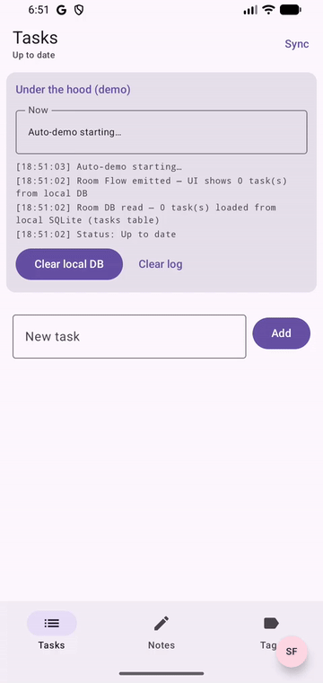
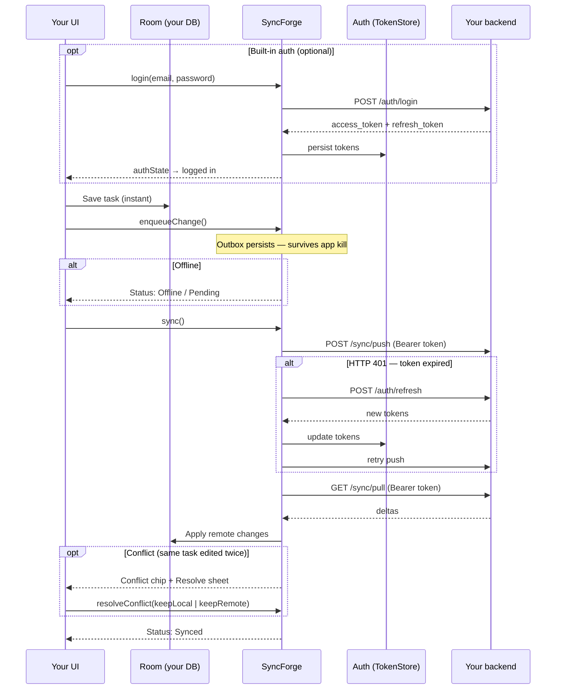

# SyncForge documentation

**Version:** `0.9.0-rc.5` · **Status:** release candidate on [Maven Central](https://central.sonatype.com/namespace/studio.syncforge) (pre-1.0 soak)

SyncForge is an offline-first sync library for Android with Kotlin Multiplatform targets for
iOS, JVM desktop, and native macOS. Your app entities live in Room (Android) or your own
store; SyncForge owns a separate SQLDelight outbox and conflict database. Mutations go through
an outbox; push/pull talk to your backend over a pluggable transport.

> Kotlin **package names** stay `dev.syncforge.*`; Maven **groupId** and Gradle **plugin id** use
> `studio.syncforge`. See [docs/MAVEN_PUBLISH.md](docs/MAVEN_PUBLISH.md).

---

## Start here

| I want to…                                     | Read this                                                                                      |
|------------------------------------------------|------------------------------------------------------------------------------------------------|
| **Get a working app in ~10 minutes**           | [Getting Started](docs/GETTING_STARTED.md)                                                     |
| **Copy-paste solutions for common tasks**      | [Recipes](docs/RECIPES.md)                                                                     |
| **Understand and configure conflict handling** | [Conflict Resolution](docs/CONFLICT_RESOLUTION.md)                                             |
| **Design entities and choose strategies**      | [Best Practices](docs/BEST_PRACTICES.md)                                                       |
| **Set up SyncForge on Android**                | [Android Setup](docs/ANDROID_SETUP.md)                                                         |
| **Set up SyncForge on iOS**                    | [iOS Setup](docs/IOS_SETUP.md)                                                                 |
| **Set up SyncForge on desktop (JVM)**          | [Desktop Setup](docs/DESKTOP_SETUP.md)                                                         |
| **Understand the KMP migration plan**          | [KMP Migration](docs/KMP_MIGRATION.md)                                                         |
| **Look up every public type**                  | [Module Reference](docs/MODULES.md)                                                            |
| **Implement the backend HTTP contract**        | [REST API](docs/REST_API.md)                                                                   |
| **Add login/register (built-in auth)**         | [Auth API](docs/AUTH_API.md)                                                                   |
| **See what's planned next**                    | [Roadmap](docs/ROADMAP.md)                                                                     |
| **Plan releases 1.0 → 2.0**                    | [Roadmap 1.0–2.0](docs/ROADMAP_1_0_TO_2_0.md) · [Word](docs/SyncForge-Roadmap-1.0-to-2.0.docx) |
| **Track 1.0 release blockers (P0)**            | [SyncForge-1.0-P0.docx](docs/SyncForge-1.0-P0.docx)                                            |
| **Launch playbook (1.0 soak, GitHub growth)**  | [SyncForge-GitHub-Launch-Playbook.docx](docs/SyncForge-GitHub-Launch-Playbook.docx)            |
| **Record README demo GIF**                     | [docs/images/README.md](docs/images/README.md)                                                 |
| **Track release changes**                      | [Changelog](CHANGELOG.md)                                                                      |

---

## See it in action

<p align="center">
  
</p>

<p align="center">
  <sub>Add task → sync → <strong>conflict</strong> → clear local DB → pull from server · <a href="docs/images/README.md">re-record</a></sub>
</p>

```bash
./gradlew :mock-server:run          # Terminal 1
./gradlew :sample:installDebug      # Terminal 2 (emulator → http://10.0.2.2:8080)
```



### What the demo shows

| Scenario               | What to do                                                        | What you see                                                               |
|------------------------|-------------------------------------------------------------------|----------------------------------------------------------------------------|
| **1. Offline-first**   | Add a task with airplane mode on                                  | Task appears in Room immediately; status shows pending / offline           |
| **2. Sync**            | Turn network on → tap **Sync**                                    | Push + pull run; row shows **Synced**; outbox drains                       |
| **3. Empty local DB**  | Tap **Clear local DB** in the demo panel → **Sync**               | Room wiped; tasks disappear; pull restores data from mock-server           |
| **4. Edit conflict**   | Sync a task → tap **Server edit** → edit locally → **Sync** again | **Conflict** chip appears; tap **Resolve** to pick local or server version |
| **5. Delete conflict** | Sync a task → edit locally → tap **Server delete** → **Sync**     | Conflict: keep local row vs accept server tombstone                        |
| **6. Multi-entity**    | Open **Notes** / **Tags** tabs                                    | Three entity types, per-type conflict strategies (`deferToUser` vs LWW)    |
| **7. Relationships**   | Add a tag → create a note with that tag                           | Notes reference tags by ID (app-level FK; sync is per entity)              |

**Debug console (debug builds):** tap the **SF** overlay to inspect the outbox, sync health, events, and open conflicts.

---

## Add to your project

Artifacts: `studio.syncforge:syncforge`, BOM, Gradle plugin `studio.syncforge.android`, and KMP
iOS/macOS/JVM variants.

**Requirements:** Kotlin 2.1+, JVM 17 · Android minSdk 24 · iOS 14+ / Xcode 15+ for Apple targets.

### Android

`settings.gradle.kts`:

```kotlin
pluginManagement {
    repositories {
        gradlePluginPortal()
        google()
        mavenCentral()
    }
}
```

`app/build.gradle.kts`:

```kotlin
plugins {
    id("com.android.application")
    id("org.jetbrains.kotlin.android")
    id("studio.syncforge.android") version "0.9.0-rc.5"
}

dependencies {
    implementation(platform("studio.syncforge:syncforge-bom:0.9.0-rc.5"))
    implementation("studio.syncforge:syncforge")
}
```

```kotlin
syncManager = SyncForge.android(this) {
    baseUrl("https://api.example.com")
    registry(SyncForgeHandlers.registry(taskDao))
    schedulePeriodicSyncOnStart()
}
```

Full walkthrough: **[Getting Started](docs/GETTING_STARTED.md)** · **[Android setup](docs/ANDROID_SETUP.md)**

### Kotlin Multiplatform + iOS

```kotlin
plugins {
    kotlin("multiplatform")
    id("com.android.library")
    id("com.google.devtools.ksp")
    id("studio.syncforge.android") version "0.9.0-rc.5"
}

kotlin {
    androidTarget()
    listOf(iosArm64(), iosSimulatorArm64()).forEach { target ->
        target.binaries.framework {
            baseName = "SyncForgeShared"
            isStatic = true
        }
    }
    sourceSets {
        commonMain.dependencies {
            implementation(platform("studio.syncforge:syncforge-bom:0.9.0-rc.5"))
            implementation("studio.syncforge:syncforge")
        }
    }
}
```

```kotlin
val syncManager = SyncForge.ios {
    baseUrl("https://api.example.com")
    registry(handlers)
    schedulePeriodicSyncOnStart()
}
```

**[iOS setup](docs/IOS_SETUP.md)** — `BGTaskScheduler`, Network framework, App Groups, mock server.

### Verify Maven Central

```bash
curl -sI "https://repo1.maven.org/maven2/studio/syncforge/syncforge-bom/0.9.0-rc.5/syncforge-bom-0.9.0-rc.5.pom" | head -1
```

Expect `HTTP/2 200`. If you see `404`, publish the staging repo in the
[Sonatype Central Portal](https://central.sonatype.com).

---

## Documentation map

```
docs/
├── README.md                 ← Folder index (main hub is this file)
├── GETTING_STARTED.md        ← Zero → working offline-first app (~10 min)
├── ANDROID_SETUP.md          ← Android DSL, SQLDelight default, Room migration
├── IOS_SETUP.md              ← iOS DSL, SQLDelight defaults, Swift integration
├── DESKTOP_SETUP.md          ← JVM desktop + native macOS DSL
├── RECIPES.md                ← How-to: merge, deferToUser, debug, observe status
├── CONFLICT_RESOLUTION.md    ← Strategies, lifecycle, Compose UI, decision guide
├── BEST_PRACTICES.md         ← Entity design, strategy choices, performance
├── KMP_MIGRATION.md          ← Room → SQLDelight, iOS targets, expect/actual plan
├── MODULES.md                ← Package-by-package API reference
├── REST_API.md               ← Backend push/pull contract
├── AUTH_API.md               ← Built-in register/login/refresh
├── ROADMAP.md                ← Phases, limitations, future work
└── images/                   ← README demo GIF (+ recording guide)
```

---

## Learning paths

### Path A — First integration (recommended)

1. [Getting Started](docs/GETTING_STARTED.md) — entity, KSP, `SyncForge.android { }`, first sync
2. [Recipes → Observe sync status](docs/RECIPES.md#observe-sync-status-in-compose) — status banner
3. [REST API](docs/REST_API.md) — wire your backend (or use `:mock-server` locally)
4. [Best Practices → Entity design](docs/BEST_PRACTICES.md#entity-design)

### Path B — Conflict-aware apps

1. [Conflict Resolution](docs/CONFLICT_RESOLUTION.md) — when conflicts happen, strategy overview
2. [Recipes → Custom merge](docs/RECIPES.md#custom-merge-with-merge--) — field-level merges
3. [Recipes → deferToUser in Compose](docs/RECIPES.md#handle-defertouser-conflicts-in-compose) — user resolution UI
4. [Best Practices → Choosing a strategy](docs/BEST_PRACTICES.md#choosing-a-conflict-strategy)

### Path C — Debugging & QA

1. [Recipes → Debug console](docs/RECIPES.md#use-the-in-app-debug-console) — `SyncDebugLauncher`
2. [Module Reference → dev.syncforge.debug](docs/MODULES.md#devsyncforgedebug--developer-observability)
3. Run `:sample` with `:mock-server` — [conflict demo](docs/GETTING_STARTED.md#try-the-conflict-demo-optional)
4. `./gradlew androidE2e` (Android) or `./gradlew iosE2e` (macOS/Xcode)

---

## Sample app

| File                                                                                                        | What it demonstrates                                  |
|-------------------------------------------------------------------------------------------------------------|-------------------------------------------------------|
| [`sample/.../SampleApplication.kt`](sample/src/main/kotlin/dev/syncforge/sample/SampleApplication.kt)       | `SyncForge.android { }`, multi-entity `conflicts { }` |
| [`sample/.../TaskRepository.kt`](sample/src/main/kotlin/dev/syncforge/sample/tasks/TaskRepository.kt)       | `enqueueChange` + `sync()`                            |
| [`sample/.../TasksScreen.kt`](sample/src/main/kotlin/dev/syncforge/sample/tasks/TasksScreen.kt)             | Conflict sheet, server edit/delete demos              |
| [`sample/.../NotesScreen.kt`](sample/src/main/kotlin/dev/syncforge/sample/notes/NotesScreen.kt)             | Second entity + optional `tagId` FK                   |
| [`sample/.../navigation/SampleApp.kt`](sample/src/main/kotlin/dev/syncforge/sample/navigation/SampleApp.kt) | Bottom nav, SF debug overlay, demo log                |

| Tab            | What it proves                                                                            |
|----------------|-------------------------------------------------------------------------------------------|
| **Tasks**      | `deferToUser()` conflicts; **Server edit** / **Server delete**; local delete + tombstones |
| **Notes**      | `lastWriteWins()`; optional relationship to tags                                          |
| **Tags**       | Third entity type in the same `SyncForgeHandlers.registry`                                |
| **Demo panel** | Clear local Room + pull restore; live outbox/sync narration (debug builds)                |

---

## Starter guides

Copy-paste paths for Android and iOS. Full walkthrough: [Getting Started](docs/GETTING_STARTED.md).

### Android developers

**1. Dependencies** — see [Add to your project → Android](#android) above.

**2. Entity + DAO** (KSP generates handlers on build):

```kotlin
@SyncForgeEntity(entityType = "tasks")
@Entity(tableName = "tasks")
@Serializable
data class TaskEntity(
    @PrimaryKey override val id: String,
    val title: String,
    val completed: Boolean = false,
    override val localVersion: Long = 0,
    override val updatedAtMillis: Long = System.currentTimeMillis(),
    override val syncState: SyncState = SyncState.SYNCED,
) : SyncedEntity
```

**3. Wire in `Application`:**

```kotlin
syncManager = SyncForge.android(this) {
    baseUrl("https://api.example.com")
    registry(SyncForgeHandlers.registry(taskDao))
    conflicts { entity("tasks") { deferToUser() } }
    schedulePeriodicSyncOnStart()
}
```

**4. Repository:**

```kotlin
syncManager.enqueueChange(Change.create("tasks", task))
syncManager.sync()
```

More: [Android setup](docs/ANDROID_SETUP.md) · [Recipes](docs/RECIPES.md)

### iOS developers

**1. Shared module** — see [Kotlin Multiplatform + iOS](#kotlin-multiplatform--ios) above.

**2. Wire in Kotlin:**

```kotlin
val syncManager = SyncForge.ios {
    baseUrl("https://api.example.com")
    registry(handlers)
    backgroundSyncTaskIdentifier("com.myapp.sync.refresh")
    schedulePeriodicSyncOnStart()
}
```

**3. Expose to Swift** — see [`sample-ios-shared`](sample-ios-shared/README.md) and [`ios-sample`](ios-sample/README.md).

### Backend (both platforms)

Implement `POST /sync/push` and `GET /sync/pull` per [REST API](docs/REST_API.md). Runnable
starters: `./gradlew :mock-server:run` · `./gradlew :backend-starter:run`

---

## Usage

```kotlin
syncManager.enqueueChange(Change.create("tasks", task))
syncManager.sync()
```

Auth: **[Auth API](docs/AUTH_API.md)** · Advanced: **[Module reference](docs/MODULES.md)**

---

## License

SyncForge is licensed under the [Apache License, Version 2.0](LICENSE).