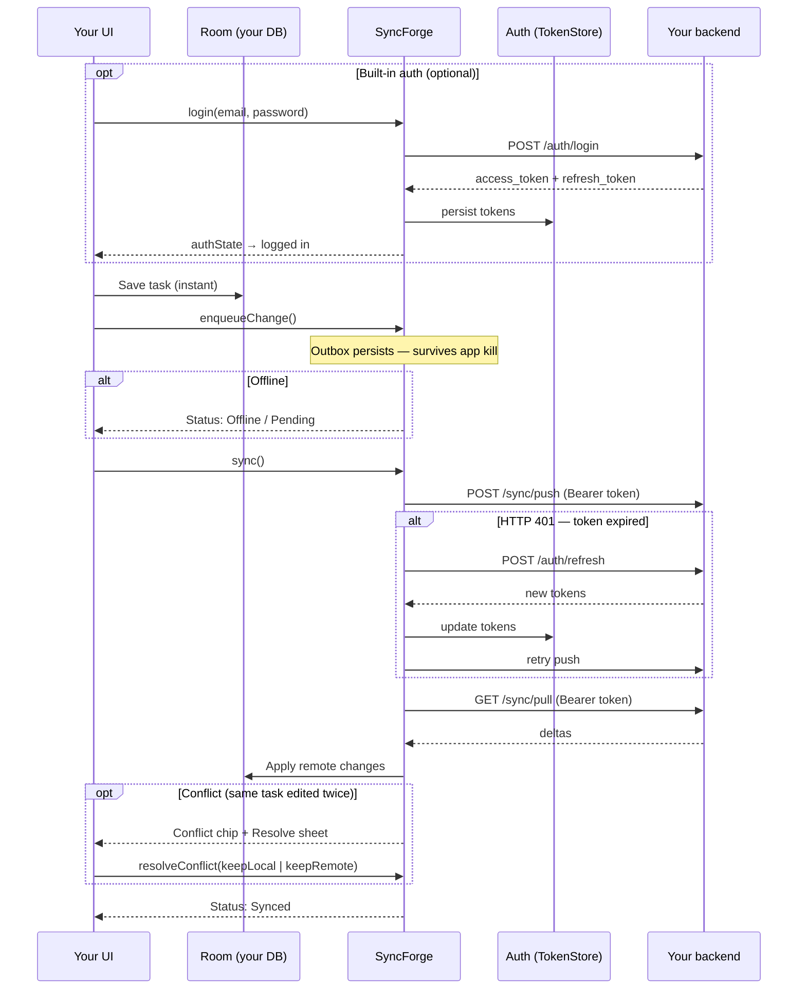

# SyncForge

A lightweight, offline-first sync library for Android (Kotlin Multiplatform).

Your app entities live in Room (or your own store on iOS). SyncForge queues mutations in a
SQLDelight outbox, syncs with your backend through a pluggable transport, and handles conflicts,
Compose status observation, and an in-app debug console.

**Current version:** `0.9.0-rc.3`  
**Maven group:** `studio.syncforge` ([Maven Central](https://central.sonatype.com/namespace/studio.syncforge))

> SyncForge is a **pre-1.0** library. Android is the reference platform; iOS, JVM desktop, and
> native macOS targets ship in the same KMP artifact. Published coordinates use `studio.syncforge`
> — see [docs/MAVEN_PUBLISH.md](docs/MAVEN_PUBLISH.md).

---

## Add to your project

Artifacts: `studio.syncforge:syncforge`, BOM, Gradle plugin `studio.syncforge.android`, and KMP
iOS/macOS/JVM variants. Kotlin **package names** stay `dev.syncforge.*`; Maven **groupId** and
Gradle **plugin id** use `studio.syncforge`.

**Requirements:** Kotlin 2.1+, JVM 17 · Android minSdk 24 · iOS 14+ / Xcode 15+ for Apple targets.

### Android

`settings.gradle.kts` — resolve the SyncForge Gradle plugin from Maven Central:

```kotlin
pluginManagement {
    repositories {
        gradlePluginPortal()
        google()
        mavenCentral()
    }
}
```

`app/build.gradle.kts`:

```kotlin
plugins {
    id("com.android.application")
    id("org.jetbrains.kotlin.android")
    id("studio.syncforge.android") version "0.9.0-rc.3"
}

dependencies {
    implementation(platform("studio.syncforge:syncforge-bom:0.9.0-rc.3"))
    implementation("studio.syncforge:syncforge")
    // Your Room database (@Database / @Dao) — runtime usually comes transitively
}
```

The `studio.syncforge.android` plugin applies KSP, Kotlin serialization, `studio.syncforge:syncforge-ksp`,
and the Room compiler — you do not declare those manually.

Wire the engine in your `Application` or activity:

```kotlin
syncManager = SyncForge.android(this) {
    baseUrl("https://api.example.com")
    registry(SyncForgeHandlers.registry(taskDao))
    schedulePeriodicSyncOnStart()
}
```

Full walkthrough (entity, DAO, Compose): **[Getting Started](docs/GETTING_STARTED.md)** ·
**[Android setup](docs/ANDROID_SETUP.md)**

### Kotlin Multiplatform + iOS

Add SyncForge to the **shared** Gradle module that compiles for iOS. Use the Android Gradle
plugin in the same project when KSP generates handlers from `@SyncForgeEntity` / `@SyncForgeDao`.

`shared/build.gradle.kts` (excerpt):

```kotlin
plugins {
    kotlin("multiplatform")
    id("com.android.library")          // if you have an androidTarget for KSP
    id("com.google.devtools.ksp")
    id("studio.syncforge.android") version "0.9.0-rc.3"  // androidTarget / KSP wiring
}

kotlin {
    androidTarget()
    listOf(iosArm64(), iosSimulatorArm64()).forEach { target ->
        target.binaries.framework {
            baseName = "SyncForgeShared"   // name used in Xcode
            isStatic = true
        }
    }
    sourceSets {
        commonMain.dependencies {
            implementation(platform("studio.syncforge:syncforge-bom:0.9.0-rc.3"))
            implementation("studio.syncforge:syncforge")
        }
    }
}
```

Build the iOS framework, then link it in Xcode (Embed & Sign). In Kotlin `iosMain`:

```kotlin
import dev.syncforge.SyncForge
import dev.syncforge.ios

val syncManager = SyncForge.ios {
    baseUrl("https://api.example.com")
    registry(handlers)
    schedulePeriodicSyncOnStart()   // optional BGTaskScheduler — see iOS guide
}
```

Expose controllers to Swift via your shared framework (see `sample-ios-shared` in this repo).

**[iOS setup](docs/IOS_SETUP.md)** — `BGTaskScheduler`, Network framework, App Groups, mock server.

### Verify resolution from Maven Central

```bash
# After the Sonatype staging repo is released (see MAVEN_PUBLISH.md)
curl -sI "https://repo1.maven.org/maven2/studio/syncforge/syncforge-bom/0.9.0-rc.3/syncforge-bom-0.9.0-rc.3.pom" | head -1
```

Expect `HTTP/2 200`. If you see `404`, complete **Close → Release** in the
[Sonatype Central Portal](https://central.sonatype.com) for the `0.9.0-rc.3` deployment.

---

## See it in action

<p align="center">
  
</p>

<p align="center">
  <sub>Offline write → sync → <strong>clear local DB</strong> (empty Room) → pull from server · <a href="docs/images/README.md">re-record</a></sub>
</p>

The `:sample` app is a multi-tab Tasks / Notes / Tags demo. Run it against the mock server in two terminals:

```bash
./gradlew :mock-server:run          # Terminal 1
./gradlew :sample:installDebug      # Terminal 2 (emulator → http://10.0.2.2:8080)
```



### What the demo shows

| Scenario | What to do | What you see |
|----------|------------|--------------|
| **1. Offline-first** | Add a task with airplane mode on | Task appears in Room immediately; status shows pending / offline |
| **2. Sync** | Turn network on → tap **Sync** | Push + pull run; row shows **Synced**; outbox drains |
| **3. Empty local DB** | Tap **Clear local DB** in the demo panel → **Sync** | Room wiped; tasks disappear; pull restores data from mock-server |
| **4. Conflict** | Sync a task → tap **Server edit** → edit locally → **Sync** again | **Conflict** chip appears; tap **Resolve** to pick local or server version |

**Debug console (debug builds):** tap the **SF** button on the Tasks tab to inspect the outbox, sync health, events, and open conflicts.

**iOS:** same flows in SwiftUI — `open ios-sample/SyncForgeTasks.xcodeproj` (see [iOS setup](docs/IOS_SETUP.md)).

---

## Usage (after dependencies)

```kotlin
syncManager.enqueueChange(Change.create("tasks", task))
syncManager.sync()
```

Auth: **[Auth API](docs/AUTH_API.md)** · runnable backend: `./gradlew :backend-starter:run`

---

## Advanced setup

Low-level `SyncForge.create()` / `createWithRetry()` and `SyncForge.builder { }` remain
available for custom wiring and tests. See [Module reference](docs/MODULES.md).

---

## License

SyncForge is licensed under the [Apache License, Version 2.0](LICENSE).

You may use, modify, and distribute this library in open-source and commercial
applications without copyleft obligations. See [LICENSE](LICENSE) for the full text.