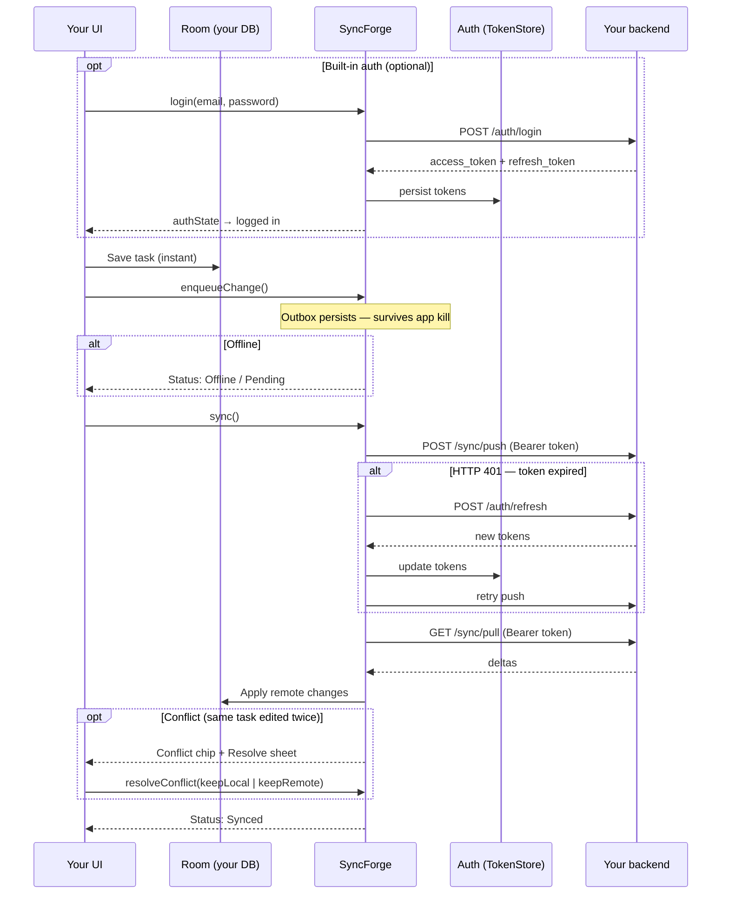

# SyncForge

A lightweight, offline-first sync library for Android (Kotlin Multiplatform).

Your app entities live in Room (or your own store on iOS). SyncForge queues mutations in a
SQLDelight outbox, syncs with your backend through a pluggable transport, and handles conflicts,
Compose status observation, and an in-app debug console.

**Current version:** `0.9.0-rc.4`  
**Maven group:** `studio.syncforge` ([Maven Central](https://central.sonatype.com/namespace/studio.syncforge))

> SyncForge is a **pre-1.0** library. Android is the reference platform; iOS, JVM desktop, and
> native macOS targets ship in the same KMP artifact. Published coordinates use `studio.syncforge`
> — see [docs/MAVEN_PUBLISH.md](docs/MAVEN_PUBLISH.md).

---

## Add to your project

Artifacts: `studio.syncforge:syncforge`, BOM, Gradle plugin `studio.syncforge.android`, and KMP
iOS/macOS/JVM variants. Kotlin **package names** stay `dev.syncforge.*`; Maven **groupId** and
Gradle **plugin id** use `studio.syncforge`.

**Requirements:** Kotlin 2.1+, JVM 17 · Android minSdk 24 · iOS 14+ / Xcode 15+ for Apple targets.

### Android

`settings.gradle.kts` — resolve the SyncForge Gradle plugin from Maven Central:

```kotlin
pluginManagement {
    repositories {
        gradlePluginPortal()
        google()
        mavenCentral()
    }
}
```

`app/build.gradle.kts`:

```kotlin
plugins {
    id("com.android.application")
    id("org.jetbrains.kotlin.android")
    id("studio.syncforge.android") version "0.9.0-rc.4"
}

dependencies {
    implementation(platform("studio.syncforge:syncforge-bom:0.9.0-rc.4"))
    implementation("studio.syncforge:syncforge")
    // Your Room database (@Database / @Dao) — runtime usually comes transitively
}
```

The `studio.syncforge.android` plugin applies KSP, Kotlin serialization, `studio.syncforge:syncforge-ksp`,
and the Room compiler — you do not declare those manually.

Wire the engine in your `Application` or activity:

```kotlin
syncManager = SyncForge.android(this) {
    baseUrl("https://api.example.com")
    registry(SyncForgeHandlers.registry(taskDao))
    schedulePeriodicSyncOnStart()
}
```

Full walkthrough (entity, DAO, Compose): **[Getting Started](docs/GETTING_STARTED.md)** ·
**[Android setup](docs/ANDROID_SETUP.md)**

## Documentation

| Topic | Guide |
|-------|-------|
| Backend contract (push/pull, tombstones) | [REST API](docs/REST_API.md) |
| Built-in auth (login, refresh) | [Auth API](docs/AUTH_API.md) |
| Conflicts, deletes, strategies | [Conflict Resolution](docs/CONFLICT_RESOLUTION.md) |
| Entity design, scale, comparisons | [Best Practices](docs/BEST_PRACTICES.md) |
| Why Room + separate outbox DB | [Getting Started → architecture](docs/GETTING_STARTED.md#how-syncforge-fits-in-your-app) |
| Full index & learning paths | [docs/README.md](docs/README.md) |

### Kotlin Multiplatform + iOS

Add SyncForge to the **shared** Gradle module that compiles for iOS. Use the Android Gradle
plugin in the same project when KSP generates handlers from `@SyncForgeEntity` / `@SyncForgeDao`.

`shared/build.gradle.kts` (excerpt):

```kotlin
plugins {
    kotlin("multiplatform")
    id("com.android.library")          // if you have an androidTarget for KSP
    id("com.google.devtools.ksp")
    id("studio.syncforge.android") version "0.9.0-rc.4"  // androidTarget / KSP wiring
}

kotlin {
    androidTarget()
    listOf(iosArm64(), iosSimulatorArm64()).forEach { target ->
        target.binaries.framework {
            baseName = "SyncForgeShared"   // name used in Xcode
            isStatic = true
        }
    }
    sourceSets {
        commonMain.dependencies {
            implementation(platform("studio.syncforge:syncforge-bom:0.9.0-rc.4"))
            implementation("studio.syncforge:syncforge")
        }
    }
}
```

Build the iOS framework, then link it in Xcode (Embed & Sign). In Kotlin `iosMain`:

```kotlin
import dev.syncforge.SyncForge
import dev.syncforge.ios

val syncManager = SyncForge.ios {
    baseUrl("https://api.example.com")
    registry(handlers)
    schedulePeriodicSyncOnStart()   // optional BGTaskScheduler — see iOS guide
}
```

Expose controllers to Swift via your shared framework (see `sample-ios-shared` in this repo).

**[iOS setup](docs/IOS_SETUP.md)** — `BGTaskScheduler`, Network framework, App Groups, mock server.

### Verify resolution from Maven Central

```bash
# After the Sonatype staging repo is released (see MAVEN_PUBLISH.md)
curl -sI "https://repo1.maven.org/maven2/studio/syncforge/syncforge-bom/0.9.0-rc.4/syncforge-bom-0.9.0-rc.4.pom" | head -1
```

Expect `HTTP/2 200`. If you see `404`, open the
[Sonatype Central Portal](https://central.sonatype.com), confirm the deployment shows all
components validated, then click **Publish** for `0.9.0-rc.4`.

---

## See it in action

<p align="center">
  
</p>

<p align="center">
  <sub>Add task → sync → <strong>conflict</strong> → clear local DB → pull from server · <a href="docs/images/README.md">re-record</a></sub>
</p>

The `:sample` app is a multi-tab Tasks / Notes / Tags demo. Run it against the mock server in two terminals:

```bash
./gradlew :mock-server:run          # Terminal 1
./gradlew :sample:installDebug      # Terminal 2 (emulator → http://10.0.2.2:8080)
```



### What the demo shows

| Scenario | What to do | What you see |
|----------|------------|--------------|
| **1. Offline-first** | Add a task with airplane mode on | Task appears in Room immediately; status shows pending / offline |
| **2. Sync** | Turn network on → tap **Sync** | Push + pull run; row shows **Synced**; outbox drains |
| **3. Empty local DB** | Tap **Clear local DB** in the demo panel → **Sync** | Room wiped; tasks disappear; pull restores data from mock-server |
| **4. Edit conflict** | Sync a task → tap **Server edit** → edit locally → **Sync** again | **Conflict** chip appears; tap **Resolve** to pick local or server version |
| **5. Delete conflict** | Sync a task → edit locally (stay offline or don't sync) → tap **Server delete** → **Sync** | Conflict: keep local row vs accept server tombstone |
| **6. Multi-entity** | Open **Notes** / **Tags** tabs | Three entity types, per-type conflict strategies (`deferToUser` vs LWW) |
| **7. Relationships** | Add a tag → create a note with that tag | Notes reference tags by ID (app-level FK; sync is per entity) |

**Debug console (debug builds):** tap the **SF** overlay to inspect the outbox, sync health, events, and open conflicts.

**iOS:** same flows in SwiftUI — `open ios-sample/SyncForgeTasks.xcodeproj` (see [iOS setup](docs/IOS_SETUP.md)).

---

## Usage (after dependencies)

```kotlin
syncManager.enqueueChange(Change.create("tasks", task))
syncManager.sync()
```

Auth: **[Auth API](docs/AUTH_API.md)** · runnable backend: `./gradlew :backend-starter:run`

---

## Advanced setup

Low-level `SyncForge.create()` / `createWithRetry()` and `SyncForge.builder { }` remain
available for custom wiring and tests. See [Module reference](docs/MODULES.md).

---

## Starter guides

Copy-paste paths for Android and iOS. Full walkthrough: [Getting Started](docs/GETTING_STARTED.md).

### Android developers

**Prerequisites:** Kotlin 2.1+, minSdk 24, Room + Compose (or your UI layer), a backend
implementing [REST API](docs/REST_API.md) push/pull (or `:mock-server` locally).

**1. Dependencies** — see [Add to your project → Android](#android) above.

**2. Entity + DAO** (KSP generates handlers on build):

```kotlin
@SyncForgeEntity(entityType = "tasks")
@Entity(tableName = "tasks")
@Serializable
data class TaskEntity(
    @PrimaryKey override val id: String,
    val title: String,
    val completed: Boolean = false,
    override val localVersion: Long = 0,
    override val updatedAtMillis: Long = System.currentTimeMillis(),
    override val syncState: SyncState = SyncState.SYNCED,
) : SyncedEntity

@SyncForgeDao(entityClass = "com.example.app.TaskEntity")
@Dao
interface TaskDao {
    @Query("SELECT * FROM tasks ORDER BY updatedAtMillis DESC")
    fun observeAll(): Flow<List<TaskEntity>>
    @Insert(onConflict = OnConflictStrategy.REPLACE)
    suspend fun insert(task: TaskEntity)
    @Update suspend fun update(task: TaskEntity)
    @Query("DELETE FROM tasks WHERE id = :id") suspend fun deleteById(id: String)
}
```

**3. Wire in `Application`:**

```kotlin
class MyApp : Application(), Configuration.Provider {
    lateinit var syncManager: SyncManager
    override val workManagerConfiguration: Configuration
        get() = SyncForgeAndroid.workManagerConfiguration { syncManager }

    override fun onCreate() {
        super.onCreate()
        val taskDao = AppDatabase.create(this).taskDao()
        syncManager = SyncForge.android(this) {
            baseUrl("https://api.example.com")  // emulator + mock: http://10.0.2.2:8080
            registry(SyncForgeHandlers.registry(taskDao))
            conflicts { entity("tasks") { deferToUser() } }
            schedulePeriodicSyncOnStart()
        }
    }
}
```

**4. Repository** — mutations go through `enqueueChange()`, UI observes Room `Flow`:

```kotlin
suspend fun addTask(title: String) {
    val task = TaskEntity(
        id = UUID.randomUUID().toString(),
        title = title.trim(),
        localVersion = 1,
        updatedAtMillis = System.currentTimeMillis(),
        syncState = SyncState.PENDING,
    )
    syncManager.enqueueChange(Change.create("tasks", task))
}

suspend fun sync() = syncManager.sync()
```

**5. Compose** — status label + sync button:

```kotlin
val syncUi = syncManager.status.map { it.toUiModel() }
    .collectAsState(initial = syncManager.status.value.toUiModel())

TextButton(onClick = { scope.launch { syncManager.sync() } }) {
    Text(if (syncUi.value.isSyncing) "Syncing…" else "Sync")
}
Text(syncUi.value.label)  // e.g. "3 changes pending", "Offline · 2 queued"
```

Optional: `SyncConflictChip` + `SyncConflictResolutionSheet` for `deferToUser()` conflicts.

**Run the reference app:**

```bash
./gradlew :mock-server:run
./gradlew :sample:installDebug
```

| Sample source | Demonstrates |
|---------------|--------------|
| [`sample/.../SampleApplication.kt`](sample/src/main/kotlin/dev/syncforge/sample/SampleApplication.kt) | `SyncForge.android { }`, multi-entity registry, conflict strategies |
| [`sample/.../TaskRepository.kt`](sample/src/main/kotlin/dev/syncforge/sample/tasks/TaskRepository.kt) | `enqueueChange` + `sync()` |
| [`sample/.../TasksScreen.kt`](sample/src/main/kotlin/dev/syncforge/sample/tasks/TasksScreen.kt) | Conflict sheet, server edit/delete demos |
| [`sample/.../navigation/SampleApp.kt`](sample/src/main/kotlin/dev/syncforge/sample/navigation/SampleApp.kt) | Bottom nav, SF debug overlay, demo log |

More: [Android setup](docs/ANDROID_SETUP.md) · [Recipes](docs/RECIPES.md)

---

### iOS developers

**Prerequisites:** Kotlin Multiplatform shared module, Xcode 15+, iOS 14+, macOS host to build
frameworks. KSP runs on `androidTarget` in the same Gradle project (or a JVM target) to generate
handlers from `@SyncForgeEntity` / `@SyncForgeDao`.

**1. Shared module** — see [Add to your project → Kotlin Multiplatform + iOS](#kotlin-multiplatform--ios) above.

**2. Wire in Kotlin** (`iosMain` or shared controller):

```kotlin
import dev.syncforge.SyncForge
import dev.syncforge.ios

val syncManager = SyncForge.ios {
    baseUrl("https://api.example.com")  // simulator + mock: http://localhost:8080
    registry(handlers)                   // EntityRegistry from KSP / manual handlers
    backgroundSyncTaskIdentifier("com.myapp.sync.refresh")
    schedulePeriodicSyncOnStart()
}
```

**3. Queue changes + sync** (same API as Android):

```kotlin
syncManager.enqueueChange(Change.create("tasks", task))
syncManager.sync()
```

**4. Expose to Swift** — wrap `SyncManager` in a controller (see `:sample-ios-shared`):

```kotlin
// IosSampleController.kt (pattern)
fun addTask(title: String, onComplete: (Boolean, String?) -> Unit) {
    scope.launch {
        runCatching {
            syncManager.enqueueChange(Change.create("tasks", newTask(title)))
        }.onSuccess { onComplete(true, null) }
            .onFailure { onComplete(false, it.message) }
    }
}
```

```swift
// SwiftUI — import SyncForgeSample
let bridge = SampleKotlinBridge(baseUrl: "http://localhost:8080", e2eMode: false)
bridge.setTasksListener { tasks in self.tasks = tasks }
bridge.addTask(title: "Buy milk") { success, error in /* ... */ }
bridge.sync { success, status in /* ... */ }
```

**5. Background sync** — `Info.plist` + register at launch:

```xml
<key>BGTaskSchedulerPermittedIdentifiers</key>
<array><string>com.myapp.sync.refresh</string></array>
```

```swift
IosBackgroundSyncKt.registerIosBackgroundSyncTasks(taskIdentifier: "com.myapp.sync.refresh")
```

For local HTTP (mock server), add `NSAllowsLocalNetworking` to Info.plist.

**Run the reference app:**

```bash
./gradlew :mock-server:run
open ios-sample/SyncForgeTasks.xcodeproj   # ⌘R on Simulator
```

| Sample source | Demonstrates |
|---------------|--------------|
| [`sample-ios-shared/.../IosSampleController.kt`](sample-ios-shared/src/iosMain/kotlin/dev/syncforge/sample/ios/IosSampleController.kt) | `SyncForge.ios { }`, listeners, enqueue + sync |
| [`ios-sample/.../SampleKotlinBridge.swift`](ios-sample/SyncForgeTasks/SampleKotlinBridge.swift) | Swift ↔ Kotlin bridge |
| [`ios-sample/.../ContentView.swift`](ios-sample/SyncForgeTasks/ContentView.swift) | SwiftUI tabs (Tasks / Notes / Tags) |
| [`ios-sample/.../AppDelegate.swift`](ios-sample/SyncForgeTasks/AppDelegate.swift) | BGTaskScheduler registration |

More: [iOS setup](docs/IOS_SETUP.md) · [ios-sample/README.md](ios-sample/README.md) ·
[sample-ios-shared/README.md](sample-ios-shared/README.md)

> **Note:** iOS ships as a KMP framework today (link in Xcode). Standalone SPM / XCFramework
> packaging is planned post-1.0.

---

### Backend (both platforms)

Implement `POST /sync/push` and `GET /sync/pull` per [REST API](docs/REST_API.md). Runnable
starters: `./gradlew :mock-server:run` (dev) · `./gradlew :backend-starter:run` (Ktor template).

---

## License

SyncForge is licensed under the [Apache License, Version 2.0](LICENSE).

You may use, modify, and distribute this library in open-source and commercial
applications without copyleft obligations. See [LICENSE](LICENSE) for the full text.