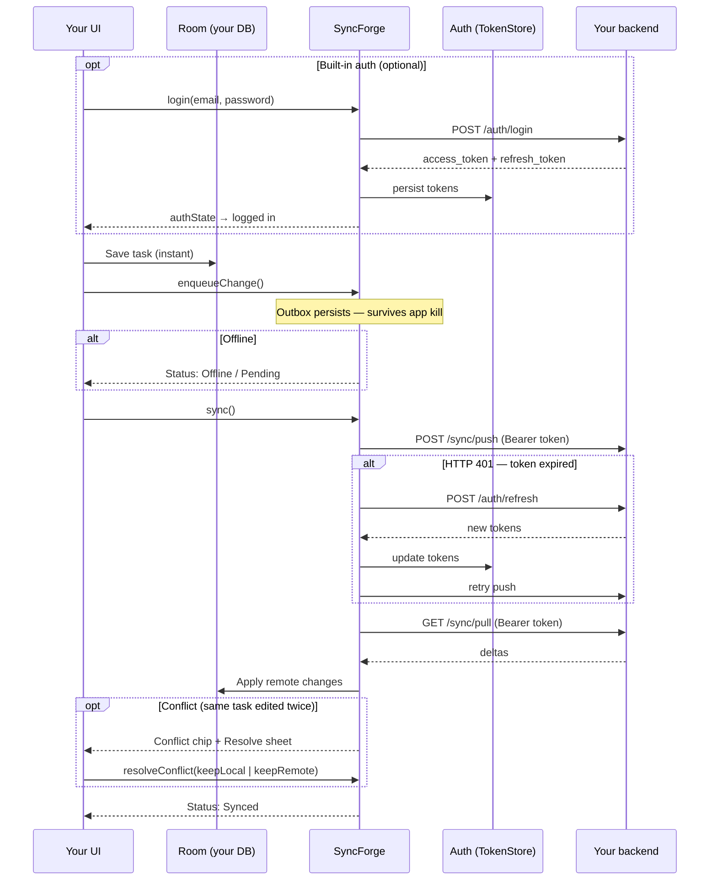

# SyncForge

A lightweight, offline-first sync library for Android (Kotlin Multiplatform).

Your app entities live in Room (or your own store on iOS). SyncForge queues mutations in a
SQLDelight outbox, syncs with your backend through a pluggable transport, and handles conflicts,
Compose status observation, and an in-app debug console.

**Current version:** `0.9.0-rc.1`

> SyncForge is a **pre-1.0** library. Android is the reference platform; iOS, JVM desktop, and
> native macOS targets are available. First Maven Central release: `0.9.0-rc.1` — see
> [docs/MAVEN_PUBLISH.md](docs/MAVEN_PUBLISH.md).

---

## See it in action

<p align="center">
  <video width="800" autoplay loop muted playsinline>
    <source src="docs/images/syncforge-demo.mp4" type="video/mp4" />
  </video>
</p>

<p align="center">
  <sub>Offline write → sync → clear local DB → pull from server · <a href="docs/images/README.md">re-record</a></sub>
</p>

The `:sample` app is a multi-tab Tasks / Notes / Tags demo. Run it against the mock server in two terminals:

```bash
./gradlew :mock-server:run          # Terminal 1
./gradlew :sample:installDebug      # Terminal 2 (emulator → http://10.0.2.2:8080)
```



### What the demo shows

| Scenario | What to do | What you see |
|----------|------------|--------------|
| **1. Offline-first** | Add a task with airplane mode on | Task appears in Room immediately; status shows pending / offline |
| **2. Sync** | Turn network on → tap **Sync** | Push + pull run; row shows **Synced**; outbox drains |
| **3. Conflict** | Sync a task → tap **Server edit** → edit locally → **Sync** again | **Conflict** chip appears; tap **Resolve** to pick local or server version |

**Debug console (debug builds):** tap the **SF** button on the Tasks tab to inspect the outbox, sync health, events, and open conflicts.

**iOS:** same flows in SwiftUI — `open ios-sample/SyncForgeTasks.xcodeproj` (see [iOS setup](docs/IOS_SETUP.md)).

---

## New here?

**[Getting Started →](docs/GETTING_STARTED.md)** — zero to a working offline-first app in under 10 minutes.

Then explore [Recipes](docs/RECIPES.md) for merge logic, conflict UI, and the debug console.

---

## What you get

| Feature | Description |
|---------|-------------|
| **Optimistic writes** | Local DB updates instantly; rollback on server rejection |
| **Persistent outbox** | Survives process death; retries with exponential backoff |
| **Push / pull / sync** | Full cycle or individual operations |
| **`SyncForge.android { }`** | ~10-line setup with Android defaults |
| **KSP codegen** | `@SyncForgeEntity` → handlers + `SyncForgeHandlers` registry |
| **Conflict strategies** | LWW, merge, defer-to-user — per entity type |
| **Debug console** | In-app outbox/conflict/event inspector (debug builds) |
| **Compose helpers** | Status observation, conflict chip, resolution sheet |
| **KMP platforms** | iOS (`SyncForge.ios`), JVM desktop (`SyncForge.desktop`), native macOS (`SyncForge.macos`) |
| **SQLDelight persistence** | Default on all platforms since 0.6.0; automatic Room → SQLDelight migration on Android upgrade |
| **Built-in auth (experimental)** | `auth { }` DSL — register/login/logout, token refresh on 401 — see [Auth API](docs/AUTH_API.md) |

[Full capabilities table →](docs/ROADMAP.md#what-the-library-can-do-today-v060)

---

## Minimal setup

```kotlin
syncManager = SyncForge.android(this) {
    baseUrl("https://api.example.com")
    registry(SyncForgeHandlers.registry(taskDao))
    schedulePeriodicSyncOnStart()
}
```

```kotlin
syncManager.enqueueChange(Change.create("tasks", task))
syncManager.sync()
```

Step-by-step walkthrough with entity, DAO, repository, and Compose: **[Getting Started](docs/GETTING_STARTED.md)**.

Auth setup: **[Auth API](docs/AUTH_API.md)** · runnable backend: `./gradlew :backend-starter:run`

---

## Requirements

- Android minSdk 24 · Kotlin 2.1+ · JVM 17

---

## Advanced setup

Low-level `SyncForge.create()` / `createWithRetry()` and `SyncForge.builder { }` remain
available for custom wiring and tests. See [Module reference](docs/MODULES.md).

---

## License

SyncForge is licensed under the [Apache License, Version 2.0](LICENSE).

You may use, modify, and distribute this library in open-source and commercial
applications without copyleft obligations. See [LICENSE](LICENSE) for the full text.