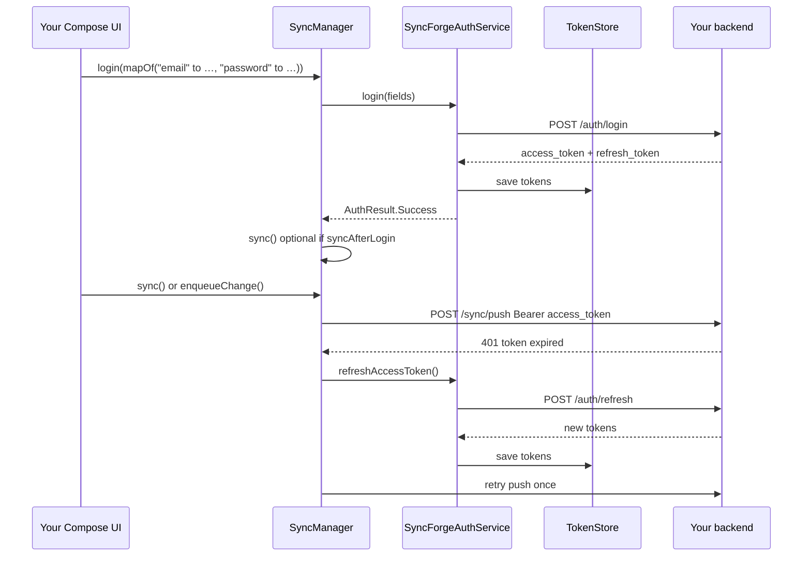

# SyncForge built-in auth

SyncForge can manage **register**, **login**, **token refresh**, and **logout** against your backend
so app developers use a single API ([SyncManager](../syncforge/src/commonMain/kotlin/dev/syncforge/sync/SyncManager.kt))
for auth and sync.

| Topic | Android guide |
|-------|----------------|
| Full Android walkthrough | [Android auth flow](#android-auth-flow) (below) |
| DSL & platform setup | [Android Setup → Built-in auth](ANDROID_SETUP.md#built-in-auth) |
| Backend contract | [HTTP endpoints](#http-endpoints-reference-backend) |
| External IdP (Auth0, Firebase) | [Bring your own IdP](#bring-your-own-idp) |

---

## Android auth flow

On Android you configure auth once in `SyncForge.android { auth { … } }`, then use the same
`SyncManager` for login, sync, and data mutations. You do **not** integrate a separate auth SDK
for the built-in flow.

### Sequence diagram



### Who owns what

| Concern | Owner |
|---------|--------|
| Login / register UI (Compose screens) | **Your app** |
| HTTP register / login / refresh | **SyncForge** (`syncManager.register` / `login`) |
| Token persistence | **SyncForge** (`TokenStore` — EncryptedSharedPreferences on Android, Keychain on iOS) |
| `Authorization: Bearer` on push/pull | **SyncForge** (`KtorSyncTransport`) |
| Refresh on HTTP 401 | **SyncForge** (`RefreshingSyncAuthProvider`) |
| Task/note mutations & sync | **SyncForge** (`enqueueChange`, `sync`) — same API as without auth |

### 1. Application setup

```kotlin
class MyApplication : Application(), Configuration.Provider {

    lateinit var syncManager: SyncManager
        private set

    override val workManagerConfiguration: Configuration
        get() = SyncForgeAndroid.workManagerConfiguration { syncManager }

    override fun onCreate() {
        super.onCreate()

        val taskDao = /* your Room DAO */

        syncManager = SyncForge.android(this) {
            // Emulator → host machine running :backend-starter
            baseUrl("http://10.0.2.2:8080")

            registry(SyncForgeHandlers.registry(taskDao, /* noteDao, tagDao, … */))

            auth {
                // Defaults: /auth/register, /auth/login, /auth/refresh
                tokenFields(
                    accessToken = "access_token",
                    refreshToken = "refresh_token",
                    expiresInSeconds = "expires_in",
                )
                // Optional overrides:
                // loginPath("/api/v1/sessions")
                // refreshRequestField("refreshToken")
                // requireAuthForSync(true)   // default — block sync when logged out
                // syncAfterLogin(true)       // default — run sync() after successful login
            }

            schedulePeriodicSyncOnStart()
        }
    }
}
```

When `auth { }` is present, `SyncForge.android` automatically:

1. Creates a platform `TokenStore`
2. Creates `SyncForgeAuthService`
3. Wires `RefreshingSyncAuthProvider` into `KtorSyncTransport`
4. Exposes `register` / `login` / `logout` on `SyncManager`

### 2. Login and register from UI

Pass any `Map<String, String>` — keys become JSON fields in the POST body:

```kotlin
class AuthViewModel(
    private val syncManager: SyncManager,
) : ViewModel() {

    val authState = syncManager.authState

    fun register(email: String, password: CharArray) {
        viewModelScope.launch {
            when (val result = syncManager.register(email, password)) {
                is AuthResult.Success -> { /* navigate to main */ }
                is AuthResult.Failure -> { /* show result.error.message */ }
            }
        }
    }

    fun login(email: String, password: CharArray) {
        viewModelScope.launch {
            when (val result = syncManager.login(email, password)) {
                is AuthResult.Success -> { /* navigate to main */ }
                is AuthResult.Failure -> { /* show result.error.message */ }
            }
        }
    }

    fun logout() {
        viewModelScope.launch { syncManager.logout() }
    }
}
```

`login(email, password: CharArray)` and `register(email, password: CharArray)` wipe the password
buffer in `finally` after the request body is built. Prefer these over `Map<String, String>` in UI
layers. The `Map` overload remains for custom field names beyond email/password.

For external IdPs (Auth0, Firebase), skip built-in `auth { }` and use `auth(SyncAuthProvider)` —
SyncForge never stores passwords in that path.

On success SyncForge parses tokens using `tokenFields`, saves them, sets `authState` to
`LoggedIn`, and optionally calls `sync()` (`syncAfterLogin` / `syncAfterRegister`, default `true`).

### 3. Observe auth state in Compose

```kotlin
@Composable
fun AppRoot(syncManager: SyncManager) {
    val authState by syncManager.authState.collectAsState()

    when (authState) {
        AuthState.LoggedOut -> LoginScreen(onLogin = { email, pw -> /* viewModel.login */ })
        is AuthState.LoggedIn -> MainNavHost(syncManager)
        AuthState.Refreshing -> LoadingScreen("Refreshing session…")
        is AuthState.Error -> LoginScreen(
            error = authState.message,
            onLogin = { /* retry */ },
        )
    }
}
```

`authState` values:

| State | Meaning |
|-------|---------|
| `LoggedOut` | No access token — show login/register |
| `LoggedIn` | Session active — enable sync UI |
| `Refreshing` | Refresh token exchange in progress |
| `Error` | Auth failed (e.g. refresh failed) — prompt re-login |

While logged out (and `requireAuthForSync` is true), `sync()`, `push()`, and `pull()` return
`SyncResult.Failure` with `SyncError.Code.AUTH`.

### 4. Data operations — unchanged API

After login, use the same sync APIs as a non-auth app:

```kotlin
// Optimistic write + outbox enqueue
taskRepository.addTask(title)

// Manual sync
viewModelScope.launch { syncManager.sync() }
```

Push/pull requests include `Authorization: Bearer <access_token>` automatically.

### 5. Token refresh (automatic)

During `sync()` / `push()` / `pull()`:

1. Server returns **401** (expired access token)
2. `KtorSyncTransport` calls `refreshAccessToken()` once
3. `POST /auth/refresh` with `{ "refresh_token": "…" }` (field name configurable)
4. New tokens saved to `TokenStore`
5. The failed request is **retried once**

**403** does not trigger refresh. If refresh fails, tokens are cleared and `authState` becomes
`Error`.

### 6. Local development

| Terminal 1 | `./gradlew :backend-starter:run` |
| Terminal 2 | `./gradlew :sample:installDebug` (when sample uses auth) |

| Server | Auth on sync routes |
|--------|---------------------|
| `:backend-starter` | Yes — Bearer required on `/sync/push` and `/sync/pull` |
| `:mock-server` | No — for existing E2E tests without login |

Android emulator base URL: `http://10.0.2.2:8080`

---

## Client setup (all platforms)

```kotlin
SyncForge.android(context) {
    baseUrl("http://10.0.2.2:8080")
    registry(SyncForgeHandlers.registry(taskDao, noteDao, tagDao))
    auth {
        tokenFields(
            accessToken = "access_token",
            refreshToken = "refresh_token",
            expiresInSeconds = "expires_in",
        )
    }
}

syncManager.register(mapOf("email" to email, "password" to password))
syncManager.login(mapOf("email" to email, "password" to password))
syncManager.sync()
syncManager.logout()
```

Same `auth { }` block works on `SyncForge.ios { }` and `SyncForge.desktop { }`.

### Token storage and migration (1.1+)

| Platform | Default `TokenStore` | Legacy migration |
|----------|---------------------|------------------|
| Android | `EncryptedSharedPreferences` (AES-256 via Android Keystore) | Plain `syncforge_auth_tokens` SharedPreferences migrated on first read, then cleared |
| iOS / macOS | Keychain (`kSecAttrAccessibleAfterFirstUnlock`) | Legacy `syncforge.auth.*` UserDefaults keys migrated on first read, then removed |
| JVM desktop | `InMemoryTokenStore` (process lifetime) | N/A — use `auth(SyncAuthProvider)` with app-owned secure storage for production desktop apps |

Upgrading from 1.0.x: existing tokens are preserved automatically; no app code changes required.

---

## HTTP endpoints (reference backend)

Implemented by `:backend-starter` for local development. Paths are configurable via `auth { }`.

### `POST /auth/register`

Request body — arbitrary JSON string fields (your schema):

```json
{ "email": "user@example.com", "password": "secret" }
```

Response (default field names):

```json
{
  "access_token": "access-…",
  "refresh_token": "refresh-…",
  "expires_in": 3600
}
```

### `POST /auth/login`

Same request/response shape as register.

### `POST /auth/refresh`

```json
{ "refresh_token": "refresh-…" }
```

Returns the same token response shape.

### Sync endpoints

When using `:backend-starter`, `POST /sync/push` and `GET /sync/pull` require:

```
Authorization: Bearer <access_token>
```

See [REST API](REST_API.md) for push/pull contract details.

`:mock-server` does **not** enforce auth (for existing E2E tests).

---

## Token field mapping

If your API uses different JSON keys:

```kotlin
auth {
    tokenFields(
        accessToken = "accessToken",
        refreshToken = "refreshToken",
        expiresInSeconds = "expiresIn",
    )
    refreshRequestField("refreshToken")
}
```

---

## Refresh on 401

`RefreshingSyncAuthProvider` is wired automatically when using `auth { }`. On HTTP **401** during
push/pull, SyncForge calls your refresh endpoint once and retries the sync request.

---

## Bring your own IdP

For Auth0, Firebase Auth, or custom OAuth, skip `auth { }` and use:

```kotlin
auth(SyncAuthProvider.refreshing(
    accessTokenProvider = { store.accessToken },
    refresh = { /* your OAuth refresh */ store.accessToken },
))
```

See [Recipes → Bearer token auth](RECIPES.md#bearer-token-auth).