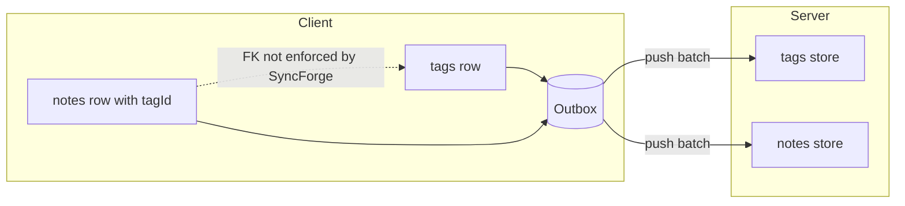

# Hierarchical sync recipes

How to sync **parent/child** and **foreign-key** relationships when SyncForge treats each
`entityType` as an independent flat row stream.

**Related:** [:sample notes + tags](../sample/src/main/kotlin/dev/syncforge/sample/notes/NoteEntity.kt),
[Best Practices → limitations](BEST_PRACTICES.md#explicit-limitations-hierarchical-data),
[Conflict Resolution](CONFLICT_RESOLUTION.md#hierarchical-data-trees-parentchild).

---

## What SyncForge does and does not do

| SyncForge provides | Your app must provide |
|--------------------|----------------------|
| Per-entity push/pull, conflicts, outbox | FK semantics across types |
| Tombstones (`DELETE` change type) | Orphan detection and cleanup |
| Per-entity conflict strategies | Parent/child sync ordering policy |
| `VALIDATION` / `CONFLICT` push rejections (server) | Server FK checks in `SyncStore.push` |

SyncForge **does not**:

- Cascade deletes from parent to child rows
- Validate foreign keys on the client before enqueue
- Topologically sort outbox batches across entity types
- Block pull on type A because type B has an open conflict (each handler is independent)
- Merge a parent and child as one atomic unit

---

## Mental model



Each arrow into the outbox is a separate `Change`. The dashed FK is **application logic only**.

---

## Recipe 1 — Optional FK (notes → tags)

Reference: `:sample` — `NoteEntity.tagId` points at `TagEntity.id`; both types register on
one `SyncManager` and sync in the same push/pull cycle without ordering guarantees.

**Client entity:**

```kotlin
@SyncForgeEntity(entityType = "notes")
data class NoteEntity(
    @PrimaryKey override val id: String,
    val title: String,
    val body: String = "",
    val tagId: String? = null,  // optional FK — synced independently
    // ...
) : SyncedEntity
```

**Conflict policy (different strategies per type):**

```kotlin
conflicts {
    entity("tags") { lastWriteWins() }      // label rows
    entity("notes") { alwaysRemote() }      // server-owned body
}
```

**Orphan scenario:** Tag deleted on server while a note still references `tagId` locally.

| Policy | Client behaviour |
|--------|------------------|
| **Display** | Show “Unknown tag” when `tagId` not in local tag table |
| **Cleanup** | After sync, null out or reassign orphan `tagId` (recipe 4) |
| **Server** | Optionally reject note push with `VALIDATION` (recipe 3) |

---

## Recipe 2 — Soft-delete parents (recommended)

Hard-deleting a parent tombstone while children still exist causes the most orphan pain.
Prefer a **soft delete** flag on the parent row:

```kotlin
data class TagEntity(
    @PrimaryKey override val id: String,
    val label: String,
    val isDeleted: Boolean = false,
    // ...
)
```

**Server:** `DELETE` change sets `isDeleted = true` but keeps the row (or keeps tombstone only
after a cleanup job removed all children).

**Client UI:** Filter `!isDeleted` in queries; children can still resolve `tagId` until
cleanup runs.

**SyncForge:** Tombstone-aware delete conflicts still apply per entity — see
[CONFLICT_RESOLUTION.md](CONFLICT_RESOLUTION.md#delete-conflicts-and-tombstones).

---

## Recipe 3 — Server: reject orphan child push

In your `SyncStore.push` (or REST handler), parse `payloadJson` and reject invalid FKs with
`VALIDATION` so the client outbox surfaces a retryable/permanent failure instead of silent drift.

```kotlin
// Inside SyncStore.push — pseudocode for notes CREATE/UPDATE
val payload = json.decodeFromString<NotePayload>(entry.payloadJson ?: "{}")
val tagId = payload.tagId
if (tagId != null && !tags.exists(tagId)) {
    rejected += PushRejectionDto(
        outboxId = entry.id,
        code = "VALIDATION",
        message = "tagId $tagId does not exist",
    )
    return@forEach
}
```

Wire codes match [REST_API.md](REST_API.md#push-response). The client maps `VALIDATION` to
`SyncError.Code.VALIDATION` and marks the outbox entry per retry policy.

**Limitation:** Cross-type checks require your server to read multiple entity tables — SyncForge
transport does not do this for you.

---

## Recipe 4 — Client: orphan cleanup after sync

Run after `syncManager.sync()` completes (or on a `syncManager.status` collector when
`LastSynced`):

```kotlin
suspend fun reconcileOrphanNoteTags(
    noteDao: NoteDao,
    tagDao: TagDao,
) {
    val validTagIds = tagDao.getAllIds().toSet()
    noteDao.getAll().forEach { note ->
        val tagId = note.tagId ?: return@forEach
        if (tagId !in validTagIds) {
            noteDao.update(note.copy(tagId = null)) // or assign default tag
        }
    }
}
```

**When to run:** Once per successful sync, or debounced in a `ViewModel` observing
`syncManager.status`. Do **not** enqueue a sync change for display-only nulling unless you
want that correction replicated to other devices.

To replicate cleanup: `enqueueChange(Change.update(note.copy(tagId = null)))` after local fix.

---

## Recipe 5 — Required parent before child (create ordering)

SyncForge does not order outbox entries across types. For **must-exist parent** workflows:

1. **Create parent first in UI** — persist parent row, `enqueueChange` parent, await push ack
   (or `status` shows pending cleared for parent) before creating child.
2. **Temporary client FK** — use a local-only placeholder `parentId` until server assigns id
   (if using server-generated ids, only create child after pull returns parent).
3. **Server idempotency** — accept child with not-yet-seen parent into a staging table and
   link on next parent pull (advanced; not provided by SyncForge).

**Anti-pattern:** Enqueue parent + child in the same frame without server validation — push
batch order within a type is defined, but **not** across types in one `sync()` call.

---

## Recipe 6 — Folder trees (self-referential parent)

`folderId` on the same `entityType` is still one flat stream — no automatic tree ordering.

| Approach | Notes |
|----------|-------|
| **Materialized path** | `path = "/root/child/"` — merge-friendly, avoids deep recursion |
| **parentId + soft delete** | Same as recipe 2; cycle detection is app-side |
| **alwaysRemote() on folders** | Structure owned by server; defer document bodies |

Tree conflict on the same row uses that type's strategy only — moving a folder and editing a
child file are **two rows**, two independent conflict paths.

---

## Strategy cheat sheet

| Entity role | Suggested strategy | Why |
|-------------|-------------------|-----|
| Parent / taxonomy (tags, folders) | `lastWriteWins()` or `alwaysRemote()` | Small rows, server or timestamp authority |
| Child content (notes, documents) | `gitLike { }` or `merge { }` | Field-level collaboration |
| High-stakes child | `deferToUser()` | User must resolve parent delete vs local edit |
| Server-owned hierarchy | `alwaysRemote()` on parent type | Client accepts server tree |

---

## Testing checklist

- [ ] Delete parent on server, edit child offline → conflict or orphan handled per policy
- [ ] Create child before parent push ack → server `VALIDATION` or client guard
- [ ] Multi-entity sync: open conflict on type A does not block type B pull (see
  `multiEntity_*` E2E in [:sample](../sample/src/androidTest/kotlin/dev/syncforge/sample/ui/ConflictStrategyE2ETest.kt))
- [ ] Soft-deleted parent still resolvable by id until cleanup job runs

---

## See also

- [RECIPES.md § Hierarchical parent/child](RECIPES.md#hierarchical-parentchild-sync)
- [BEST_PRACTICES.md](BEST_PRACTICES.md#hierarchical-data-trees-and-relationships)
- [REST_API.md](REST_API.md) — push rejection codes